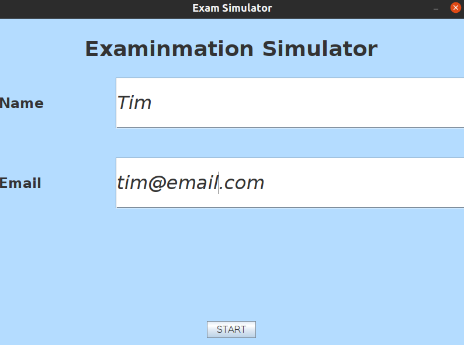
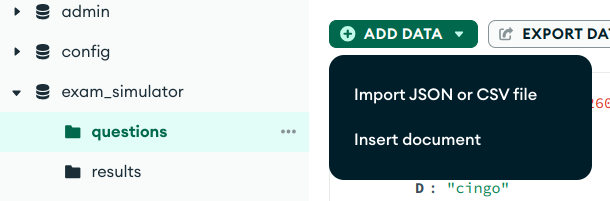

# Exam Simulator

## Environment
- Ubuntu20.04
- Java (Server and Client)
- Java Swing (GUI)
- MongoDB (Database)

## Introduction

We build an exam simulator GUI executable under a Java Maven project. This exam system serves as both server and client system. Java Swing is used to design GUI layout. The application contains sign-up page, exam page, and result page. The user informations stored in mongo database. The exam is only allow user to register with an email ONCE.

## Demonstration




*ps.: user and exam result information are stored in **users** and **results** collection respectively.*

## Installation

- Install Java JRE

```
$ sudo apt install openjdk-17-jre-headless -y
```

- Install Java JDK

```
$ sudo apt install default-jdk
```

- Install [mongodb](https://www.mongodb.com/docs/manual/tutorial/install-mongodb-on-ubuntu/) with [mongo compass](https://www.mongodb.com/docs/compass/current/install/)

## Instruction

### Start Mongodb

```
$ sudo systemctl start mongod
```

- create **exam_simulator** datalake and **questions** collection, and import **exam_simulator.questions.json** into
**questions** collection



### Start Execution

```
$ java -jar ./exam_simulator.jar
```

## References
- [MongoDB Java](https://www.runoob.com/mongodb/mongodb-java.html)
- [Create your First Java Frame using Visual Studio Code | Create Java GUI Forms using VS Code](https://www.youtube.com/watch?v=5G2XM1nlX5Q)
- [Java AWT | GridLayout Class](https://www.geeksforgeeks.org/java-awt-gridlayout-class/)
- [How to Set JPanel's Width and Height?](https://stackoverflow.com/questions/5921175/how-to-set-jpanels-width-and-height)
- [How to Use GridBagLayout](https://docs.oracle.com/javase/tutorial/uiswing/layout/gridbag.html)
- [Java GUI Tutorial #14 - GridBagLayout Manager In Java GUI Swing Explained](https://www.youtube.com/watch?v=NJjXTzEwU1s)
- [【從零開始學 Java 程式設計】JRadioButton 元件](https://tw-hkt.blogspot.com/2019/06/java-jradiobutton.html)
- [HashMap get() Method in Java](https://www.geeksforgeeks.org/hashmap-get-method-in-java/)
- [How to replace existing value of ArrayList element in Java [duplicate]](https://stackoverflow.com/questions/23981008/how-to-replace-existing-value-of-arraylist-element-in-java)
- [Extract Multiple Fields Using MongoDB 3.2.0 Java Driver](https://stackoverflow.com/questions/34695546/extract-multiple-fields-using-mongodb-3-2-0-java-driver)
- [How to Iterate HashMap in Java?](https://www.geeksforgeeks.org/how-to-iterate-hashmap-in-java/)
- [Java ArrayList](https://www.runoob.com/java/java-arraylist.html)
- [How to make multiple values per key in a Java map possible example](https://www.theserverside.com/blog/Coffee-Talk-Java-News-Stories-and-Opinions/How-to-make-multiple-values-per-key-in-a-Java-map-possible)
- [How to save Timestamp type value in MongoDb | Java](https://stackoverflow.com/questions/27895955/how-to-save-timestamp-type-value-in-mongodb-java)
- [How to compare strings in Java](https://sentry.io/answers/how-to-compare-strings-in-java/)
- [How can I remove a JPanel from a JFrame?](https://stackoverflow.com/questions/2501861/how-can-i-remove-a-jpanel-from-a-jframe)
